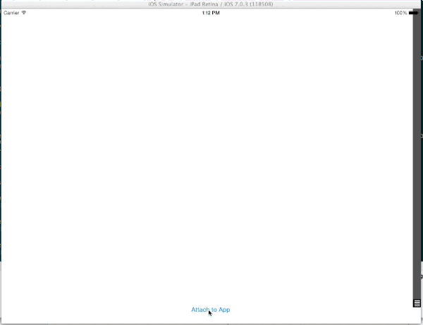

DDMultipeerConsole
==================

A console for viewing log messages from [DDMultipeerLogger](https://github.com/pj4533/DDMultipeerLogger)

Using multipeer connectivity for communication, and [LumberjackConsole](https://github.com/PTEz/LumberjackConsole) for displaying messages.

## Usage

DDMultipeerConsole uses the view controller & assistant helpers built into the MultipeerConnectivity framework.  Simply choose to 'Attach to App' when a nearby app is running that has DDMultipeerLogger integrated.

## Contact

PJ Gray

- http://github.com/pj4533
- http://twitter.com/pj4533
- pj@pj4533.com

## License

DDMultipeerLogger is available under the MIT license. See the LICENSE file for more info.

